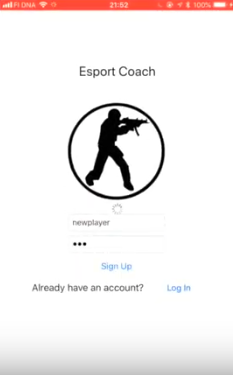
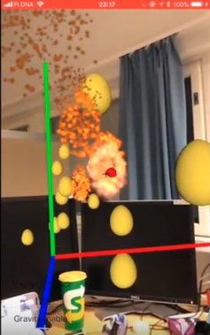
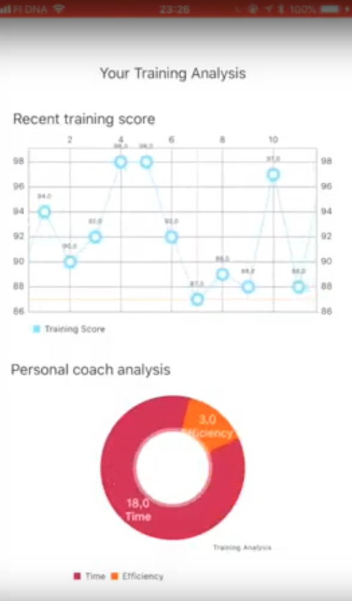
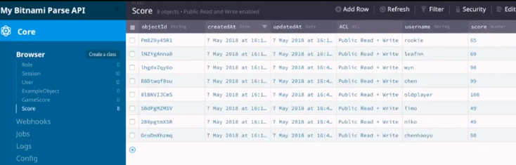
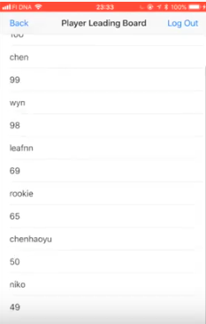

# Esport_Coach
An iOS application that implements a 3D shooting game @chenhaoyu

'Design © Copyright 2019 by Haoyu Chen'

Esport coach
==========================

An iOS application for training e-sport game players

## Operating Systems
- **Mac OSX** Mavericks and above.

## Usage：

Use Xcode to open the project

build and run the project

## Function：
0. User login

    

1. AR shooting in realworld

    

2. detailed training data analysis

    

3. all data can be stored online (AWS server is employed)

    

4. online ranking list

    

## Note：

1. AWS server is needed
2. iOS 13.0 and above is needed

## To do：

1. Scene to be more complex
2. Need a free server

## see more from the youtube video:

[1 min demo](https://www.youtube.com/watch?v=LXTJqMsCMDQ)

    

## Acknowledge
This application of the final project of Mobile Social Computing course. Team MoreX member: Haoyu Chen, Mikko Lehto, Ville Kemppainen, Timo Mattila

Copyright@ Chen Haoyu
